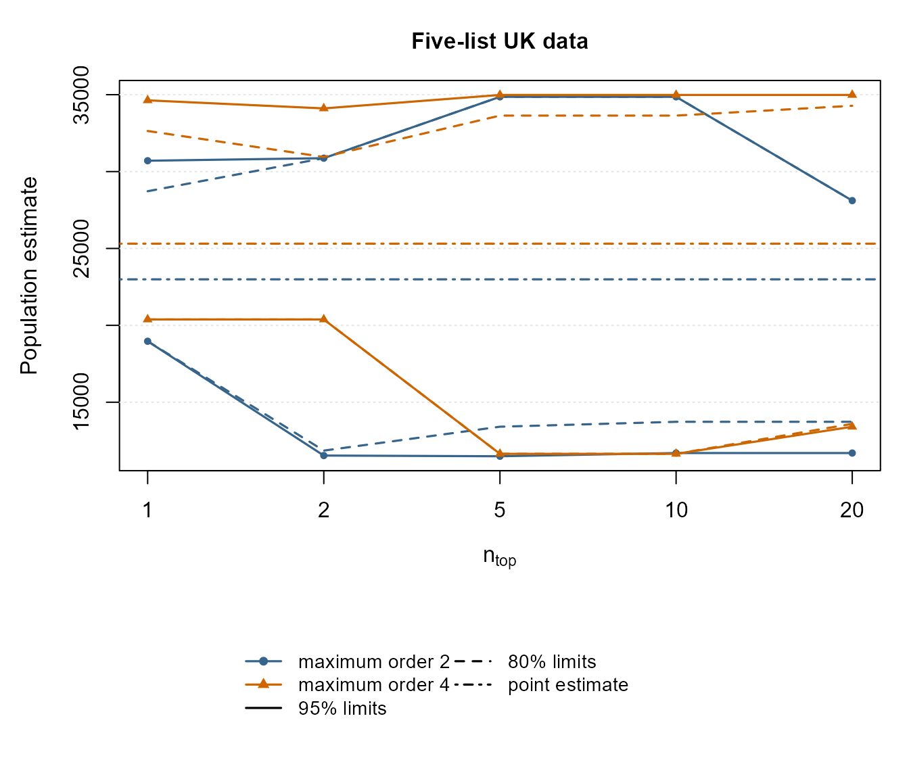
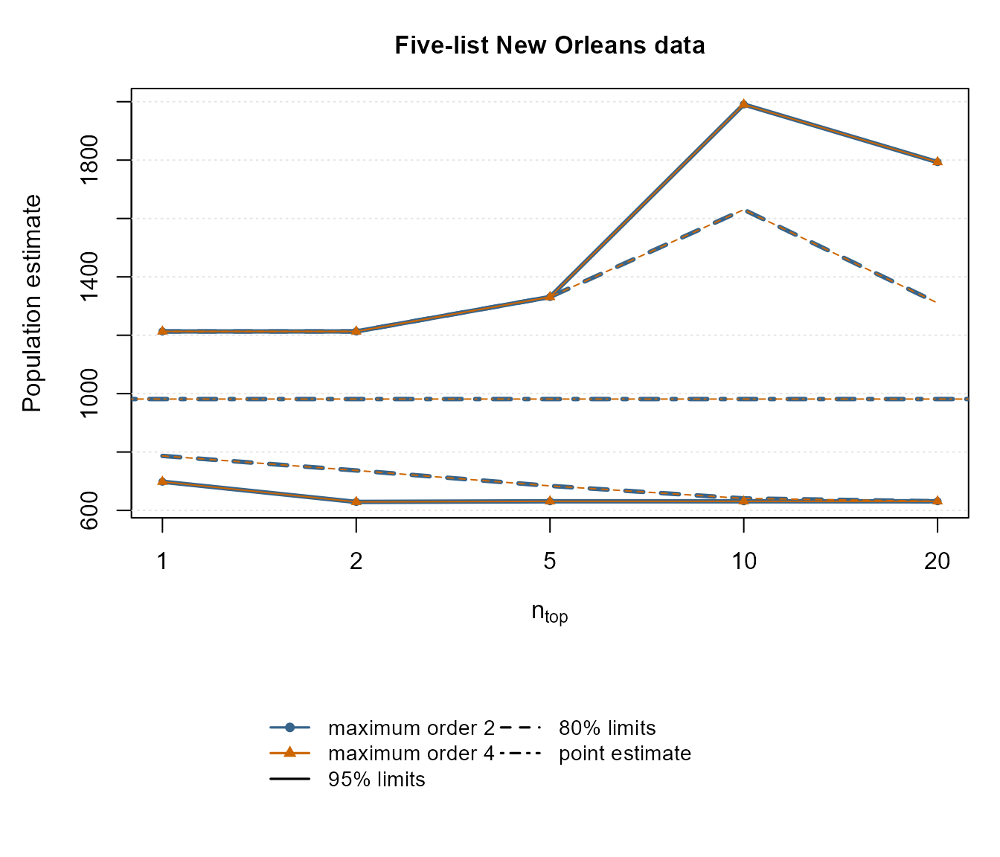
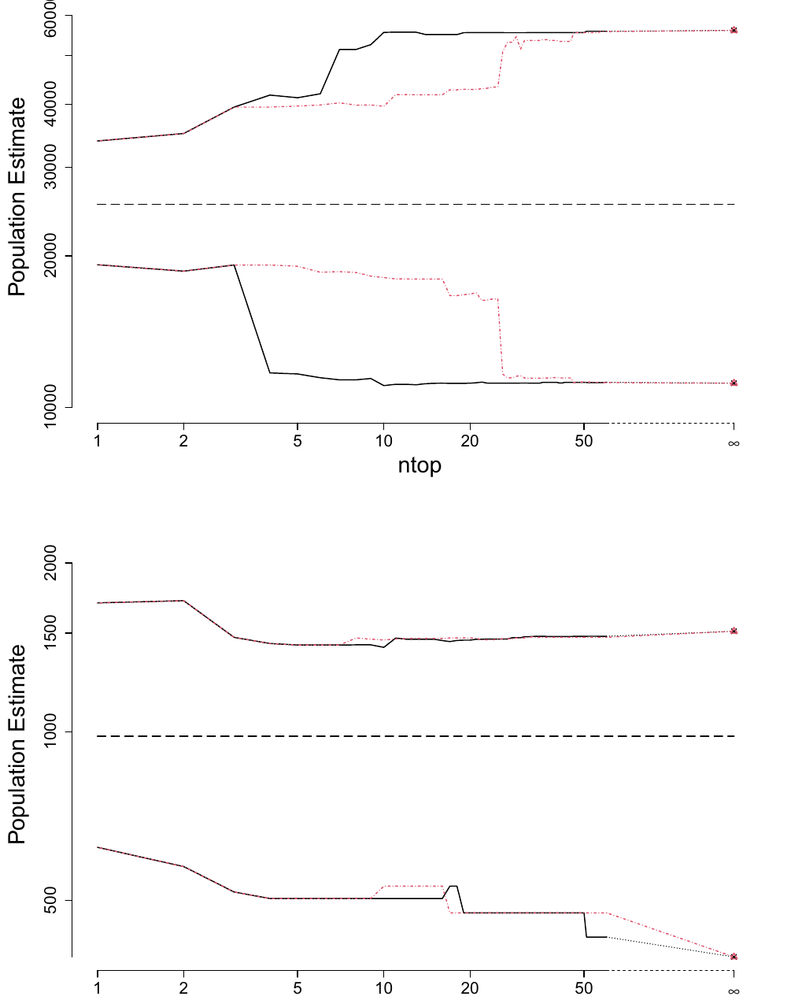

# Reproducing Silverman, Chan and Vincent (2024)

## Introduction

This vignette gives reproducibility code for the numerical results in

Silverman, B. W., Chan, L. and Vincent, K. (2024). *Bootstrapping
multiple systems estimates to account for model selection*, *Statistics
and Computing* **34**, 44.

The calculations use the current `MultipleSystemsEstimation` interface.

There are two intended ways to use the vignette. In the version built
with the package, `full_reproduction` is `FALSE`. This uses `nboot = 10`
and restricts the more expensive five-list finite searches to modest
values of `ntop`: 20 for the ordinary ranking and 10 for the degree-2
ranking. These settings are enough to exercise the current code, produce
the figures and tables in reduced-precision form, and keep an ordinary
package or CRAN vignette build reasonably quick. They are not intended
to reproduce the published Monte Carlo values exactly.

For a closer numerical reproduction of the paper, change

``` r

full_reproduction <- TRUE
```

in the setup chunk. This uses `nboot = 1000`, the value used for the
paper, and extends the finite five-list calculations to `ntop = 60`.
Calculations requiring an exhaustive search over all five-list candidate
models remain deliberately excluded from an ordinary vignette build;
where those results are required, the published values are given and the
code needed to recompute them is shown with `eval = FALSE`. Such
exhaustive calculations can take substantially longer.

Table 1 of the paper is not reproduced. It illustrates the issue of
existence of the extended maximum likelihood estimate rather than
providing a numerical application. The package function
[`check_identifiability()`](https://bernardsilverman.github.io/MultipleSystemsEstimation/reference/check_identifiability.md)
provides the corresponding diagnostic.

## Helper functions

``` r

pick_ntop <- function(x, values) {
  out <- x$inference[x$inference$ntop %in% values, , drop = FALSE]
  out[match(values, out$ntop), , drop = FALSE]
}

ci_text <- function(lo, hi, rounding = 1) {
  lo <- round(lo / rounding) * rounding
  hi <- round(hi / rounding) * rounding
  paste0("[", lo, ", ", hi, "]")
}

finite_at <- function(max_ntop) {
  z <- c(1, 2, 5, 10, 20, 50, 60)
  z[z <= max_ntop]
}

plot_ntop_set <- function(x, at, col, pch, lwd = 1.6) {
  z <- x[x$ntop %in% at, , drop = FALSE]
  z <- z[match(at, z$ntop), , drop = FALSE]
  xx <- seq_along(at)

  lines(xx, z[["0.025"]], lty = 1, col = col, lwd = lwd)
  lines(xx, z[["0.975"]], lty = 1, col = col, lwd = lwd)

  points(xx, z[["0.025"]], col = col, pch = pch, cex = 0.75)
  points(xx, z[["0.975"]], col = col, pch = pch, cex = 0.75)

  if (all(c("0.1", "0.9") %in% names(z))) {
    lines(xx, z[["0.1"]], lty = 2, col = col, lwd = lwd)
    lines(xx, z[["0.9"]], lty = 2, col = col, lwd = lwd)
  }
}

plot_two_ntop_bands <- function(x2, est2, x4, est4, at, main,
                                lwd2 = 1.6, lwd4 = 1.6) {
  z2 <- x2[x2$ntop %in% at, , drop = FALSE]
  z2 <- z2[match(at, z2$ntop), , drop = FALSE]

  z4 <- x4[x4$ntop %in% at, , drop = FALSE]
  z4 <- z4[match(at, z4$ntop), , drop = FALSE]

  ylim <- range(
    z2[["0.025"]], z2[["0.975"]], est2,
    z4[["0.025"]], z4[["0.975"]], est4,
    finite = TRUE
  )

  xx <- seq_along(at)

  plot(
    xx, rep(NA_real_, length(xx)),
    type = "n",
    xaxt = "n",
    xlab = expression(n[top]),
    ylab = "Population estimate",
    ylim = ylim,
    main = main,
    cex.main = 1.05,
    cex.lab = 1.05
  )

  axis(1, at = xx, labels = at)
  grid(nx = NA, ny = NULL, lty = 3, col = "grey90")

  plot_ntop_set(x2, at, "steelblue4", 16, lwd = lwd2)
  plot_ntop_set(x4, at, "darkorange3", 17, lwd = lwd4)

  abline(h = est2, lty = 4, col = "steelblue4", lwd = lwd2)
  abline(h = est4, lty = 4, col = "darkorange3", lwd = lwd4)
}

legend_two_ntop_bands <- function() {
  plot.new()
  legend(
    "center",
    legend = c(
      "maximum order 2", "maximum order 4",
      "95% limits", "80% limits", "point estimate"
    ),
    col = c(
      "steelblue4", "darkorange3",
      "black", "black", "black"
    ),
    lty = c(1, 1, 1, 2, 4),
    pch = c(16, 17, NA, NA, NA),
    lwd = c(1.6, 1.6, 1.6, 1.6, 1.6),
    ncol = 2,
    cex = 0.9,
    bty = "n"
  )
}
```

## Table 2: Kosovo

Kosovo has only 113 admissible candidate models, so the exhaustive
calculation over candidate models is manageable and is carried out
directly. With the ordinary vignette settings the bootstrap uses only 10
replications; set `full_reproduction <- TRUE` to use the paper’s
`nboot = 1000`.

``` r

data(Kosovo)

kos <- vary_ntop_bca(
  Kosovo,
  maxorder = ncol(Kosovo) - 2,
  ntopmax = Inf,
  degree = 1,
  nboot = nboot_vignette,
  iseed = 1234,
  alpha = c(0.025, 0.1, 0.9, 0.975)
)

kos_last <- max(kos$inference$ntop)
kos_tab <- pick_ntop(kos, c(1, 5, 10, kos_last))

table2 <- data.frame(
  ntop = c("1", "5", "10", paste0(kos_last, " (Inf)")),
  `80% CI` = ci_text(kos_tab[["0.1"]], kos_tab[["0.9"]], 100),
  `95% CI` = ci_text(kos_tab[["0.025"]], kos_tab[["0.975"]], 100),
  check.names = FALSE
)

knitr::kable(table2)
```

| ntop      | 80% CI          | 95% CI          |
|:----------|:----------------|:----------------|
| 1         | \[9700, 11800\] | \[9600, 11800\] |
| 5         | \[9800, 10200\] | \[9800, 11500\] |
| 10        | \[8700, 11400\] | \[8700, 12000\] |
| 113 (Inf) | \[8700, 11400\] | \[8700, 12000\] |

The published table, rounded to the nearest 100, is:

``` r

table2_published <- data.frame(
  ntop = c("1", "5", "10", "113 (Inf)"),
  `80% CI` = c(
    "[9500, 11300]",
    "[8500, 11500]",
    "[7400, 12200]",
    "[7400, 12200]"
  ),
  `95% CI` = c(
    "[9100, 12000]",
    "[8500, 17000]",
    "[6900, 18000]",
    "[6900, 18000]"
  ),
  check.names = FALSE
)

knitr::kable(table2_published)
```

| ntop      | 80% CI          | 95% CI          |
|:----------|:----------------|:----------------|
| 1         | \[9500, 11300\] | \[9100, 12000\] |
| 5         | \[8500, 11500\] | \[8500, 17000\] |
| 10        | \[7400, 12200\] | \[6900, 18000\] |
| 113 (Inf) | \[7400, 12200\] | \[6900, 18000\] |

## Table 3: Korea

There are only six admissible models after the existence check, so the
exhaustive calculation is again run directly. As for Table 2,
`full_reproduction <- TRUE` changes the bootstrap from 20 to 1000
replications.

``` r

data(Korea)

kor <- vary_ntop_bca(
  Korea,
  maxorder = 2,
  ntopmax = Inf,
  degree = 1,
  nboot = nboot_vignette,
  iseed = 1234,
  alpha = c(0.025, 0.1, 0.9, 0.975)
)

kor_last <- max(kor$inference$ntop)
kor_tab <- pick_ntop(kor, c(1, 2, kor_last))

table3 <- data.frame(
  ntop = c("1", "2", paste0(kor_last, " (Inf)")),
  `80% CI` = ci_text(kor_tab[["0.1"]], kor_tab[["0.9"]]),
  `95% CI` = ci_text(kor_tab[["0.025"]], kor_tab[["0.975"]]),
  check.names = FALSE
)

knitr::kable(table3)
```

| ntop    | 80% CI       | 95% CI       |
|:--------|:-------------|:-------------|
| 1       | \[135, 188\] | \[135, 201\] |
| 2       | \[135, 320\] | \[135, 336\] |
| 6 (Inf) | \[135, 320\] | \[135, 336\] |

The published intervals are:

``` r

table3_published <- data.frame(
  ntop = c("1", "2", "6 (Inf)"),
  `80% CI` = c("[136, 198]", "[135, 286]", "[135, 288]"),
  `95% CI` = c("[131, 248]", "[130, 348]", "[128, 349]"),
  check.names = FALSE
)

knitr::kable(table3_published)
```

| ntop    | 80% CI       | 95% CI       |
|:--------|:-------------|:-------------|
| 1       | \[136, 198\] | \[131, 248\] |
| 2       | \[135, 286\] | \[130, 348\] |
| 6 (Inf) | \[135, 288\] | \[128, 349\] |

## Figure 1: five-list UK data

The finite-`ntop` calculations are performed directly. In an ordinary
vignette build they are calculated through `ntop = 20`; with
`full_reproduction <- TRUE` they are calculated through `ntop = 60`,
with `nboot = 1000`, as used for the finite part of the paper’s figure.

``` r

data(UKdat_5)

uk2 <- vary_ntop_bca(
  UKdat_5,
  maxorder = 2,
  ntopmax = ntop_vignette,
  degree = 1,
  nboot = nboot_vignette,
  iseed = 1234,
  alpha = c(0.025, 0.1, 0.9, 0.975)
)

uk4 <- vary_ntop_bca(
  UKdat_5,
  maxorder = 4,
  ntopmax = ntop_vignette,
  degree = 1,
  nboot = nboot_vignette,
  iseed = 1234,
  alpha = c(0.025, 0.1, 0.9, 0.975)
)
```

The paper also shows the exhaustive result at `ntop = Inf`. Repeating an
exhaustive bootstrap search over all five-list models is deliberately
omitted from an ordinary vignette build. The legend is placed in a
separate strip below the plotting region so that it does not obscure the
confidence-limit curves.

``` r

at1 <- finite_at(ntop_vignette)

oldpar <- par(no.readonly = TRUE)
layout(matrix(c(1, 2), nrow = 2), heights = c(5, 1.6))

par(mar = c(4.5, 4.5, 3, 1) + 0.1)
plot_two_ntop_bands(
  pick_ntop(uk2, at1), uk2$estimate,
  pick_ntop(uk4, at1), uk4$estimate,
  at = at1,
  main = "Five-list UK data"
)

par(mar = c(0, 0, 0, 0))
legend_two_ntop_bands()
```



``` r


layout(1)
par(oldpar)
```

The published exhaustive 95% intervals, from Table 6 of the paper, are
`[11456, 43894]` for maximum order 2 and `[11168, 56052]` for maximum
order 4. Those values may be added as an `Inf` benchmark for an exact
visual reproduction.

To recompute an exhaustive endpoint from scratch, replace
`ntopmax = ntop_vignette` in the relevant call by `ntopmax = Inf` and
use `nboot = 1000`. This can be substantially more expensive than the
finite calculation.

## Figure 2: five-list New Orleans data

Again the finite calculations are performed directly, through
`ntop = 20` for the ordinary vignette and through `ntop = 60` when
`full_reproduction <- TRUE`.

``` r

data(NewOrl_5)

no2 <- vary_ntop_bca(
  NewOrl_5,
  maxorder = 2,
  ntopmax = ntop_vignette,
  degree = 1,
  nboot = nboot_vignette,
  iseed = 1234,
  alpha = c(0.025, 0.1, 0.9, 0.975)
)

no4 <- vary_ntop_bca(
  NewOrl_5,
  maxorder = 4,
  ntopmax = ntop_vignette,
  degree = 1,
  nboot = nboot_vignette,
  iseed = 1234,
  alpha = c(0.025, 0.1, 0.9, 0.975)
)
```

The two sets of curves are essentially coincident for the finite values
shown.

``` r

at2 <- finite_at(ntop_vignette)

oldpar <- par(no.readonly = TRUE)
layout(matrix(c(1, 2), nrow = 2), heights = c(5, 1.6))

par(mar = c(4.5, 4.5, 3, 1) + 0.1)
plot_two_ntop_bands(
  pick_ntop(no2, at2), no2$estimate,
  pick_ntop(no4, at2), no4$estimate,
  at = at2,
  main = "Five-list New Orleans data",
  lwd2 = 3,
  lwd4 = 1
)

par(mar = c(0, 0, 0, 0))
legend_two_ntop_bands()
```



``` r


layout(1)
par(oldpar)
```

For `ntop = Inf`, the paper reports upper 97.5% limits of 1544 for
maximum order 2 and 1547 for maximum order 4. The exhaustive calculation
is again not performed in an ordinary vignette build. To recompute it,
use `ntopmax = Inf` and `nboot = 1000` in the relevant call.

## Table 4: location of the bootstrap BIC minimum

Table 4 asks, for each bootstrap sample, where the globally optimal
bootstrap model lies in the original-data BIC ranking. Thus it
intrinsically requires an exhaustive bootstrap search. The calculation
is therefore shown but not evaluated in an ordinary vignette build.

The following code carries out the calculation. It uses 1000 bootstrap
samples, as in the paper.

``` r

bootstrap_optimal_ranks <- function(zdat, maxorder,
                                    nboot = 1000, iseed = 1234) {
  z <- MultipleSystemsEstimation:::assemble_bic(
    zdat, maxorder = maxorder
  )

  z <- MultipleSystemsEstimation:::bootstrapcal(
    z, nboot = nboot, iseed = iseed
  )

  original_order <- order(z$res[, "BIC"])

  vapply(seq_len(nboot), function(b) {
    v <- z$bootbic[, b]
    ok <- which(is.finite(v))
    if (!length(ok)) return(NA_integer_)

    best <- ok[which.min(v[ok])]
    match(best, original_order)
  }, integer(1))
}

rank_counts <- function(r, ntop = c(1, 5, 10, 50, 100)) {
  vapply(
    ntop,
    function(k) sum(r <= k, na.rm = TRUE),
    integer(1)
  )
}

ranks4 <- list(
  Kosovo = bootstrap_optimal_ranks(
    Kosovo, maxorder = ncol(Kosovo) - 2
  ),
  UK2 = bootstrap_optimal_ranks(UKdat_5, maxorder = 2),
  UK4 = bootstrap_optimal_ranks(UKdat_5, maxorder = 4),
  NewOrleans2 = bootstrap_optimal_ranks(NewOrl_5, maxorder = 2),
  NewOrleans4 = bootstrap_optimal_ranks(NewOrl_5, maxorder = 4)
)

sapply(ranks4, rank_counts)
```

The published counts, out of 1000 bootstrap samples, are:

``` r

table4 <- data.frame(
  dataset = c(
    "Kosovo",
    "UK (maxorder 2)",
    "UK (maxorder 4)",
    "New Orleans (maxorder 2)",
    "New Orleans (maxorder 4)"
  ),
  `1` = c(375, 216, 156, 357, 357),
  `5` = c(929, 583, 622, 622, 621),
  `10` = c(997, 739, 732, 698, 697),
  `50` = c(1000, 930, 898, 915, 913),
  `100` = c(1000, 954, 943, 958, 956),
  check.names = FALSE
)

knitr::kable(table4)
```

| dataset                  |   1 |   5 |  10 |   50 |  100 |
|:-------------------------|----:|----:|----:|-----:|-----:|
| Kosovo                   | 375 | 929 | 997 | 1000 | 1000 |
| UK (maxorder 2)          | 216 | 583 | 739 |  930 |  954 |
| UK (maxorder 4)          | 156 | 622 | 732 |  898 |  943 |
| New Orleans (maxorder 2) | 357 | 622 | 698 |  915 |  958 |
| New Orleans (maxorder 4) | 357 | 621 | 697 |  913 |  956 |

## Table 5: degree-2 ranking for Kosovo

The ordinary BIC ordering is `degree = 1`; the neighbourhood-based
ordering from Section 5.1 of the paper is `degree = 2`.

Kosovo is small enough for both orderings to be calculated exhaustively.
The ordinary vignette uses 10 bootstrap replications;
`full_reproduction <- TRUE` uses 1000.

``` r

kos_d2 <- vary_ntop_bca(
  Kosovo,
  maxorder = ncol(Kosovo) - 2,
  ntopmax = Inf,
  degree = 2,
  nboot = nboot_vignette,
  iseed = 1234,
  alpha = c(0.025, 0.975)
)

kos1_95 <- pick_ntop(kos, c(1, 5, 10, max(kos$inference$ntop)))
kos2_95 <- pick_ntop(kos_d2, c(1, 5, 10, max(kos_d2$inference$ntop)))

table5 <- data.frame(
  ntop = c("1", "5", "5", "10", "10",
           paste0(max(kos$inference$ntop), " (Inf)")),
  degree = c("1, 2", "1", "2", "1", "2", "1, 2"),
  `95% CI` = c(
    ci_text(kos1_95[1, "0.025"], kos1_95[1, "0.975"], 100),
    ci_text(kos1_95[2, "0.025"], kos1_95[2, "0.975"], 100),
    ci_text(kos2_95[2, "0.025"], kos2_95[2, "0.975"], 100),
    ci_text(kos1_95[3, "0.025"], kos1_95[3, "0.975"], 100),
    ci_text(kos2_95[3, "0.025"], kos2_95[3, "0.975"], 100),
    ci_text(kos1_95[4, "0.025"], kos1_95[4, "0.975"], 100)
  ),
  check.names = FALSE
)

knitr::kable(table5)
```

| ntop      | degree | 95% CI          |
|:----------|:-------|:----------------|
| 1         | 1, 2   | \[9600, 11800\] |
| 5         | 1      | \[9800, 11500\] |
| 5         | 2      | \[8700, 12100\] |
| 10        | 1      | \[8700, 12000\] |
| 10        | 2      | \[8700, 12000\] |
| 113 (Inf) | 1, 2   | \[8700, 12000\] |

The published values are:

``` r

table5_published <- data.frame(
  ntop = c("1", "5", "5", "10", "10", "113 (Inf)"),
  degree = c("1, 2", "1", "2", "1", "2", "1, 2"),
  `95% CI` = c(
    "[9100, 12000]",
    "[7900, 17400]",
    "[8000, 13500]",
    "[6900, 18000]",
    "[8000, 17700]",
    "[6900, 18000]"
  ),
  check.names = FALSE
)

knitr::kable(table5_published)
```

| ntop      | degree | 95% CI          |
|:----------|:-------|:----------------|
| 1         | 1, 2   | \[9100, 12000\] |
| 5         | 1      | \[7900, 17400\] |
| 5         | 2      | \[8000, 13500\] |
| 10        | 1      | \[6900, 18000\] |
| 10        | 2      | \[8000, 17700\] |
| 113 (Inf) | 1, 2   | \[6900, 18000\] |

#### Figure 3: degree-1 and degree-2 rankings

The degree-2 calculation underlying Figure 3 is substantially more
computationally expensive than the other calculations in this vignette.
To keep routine package builds and CRAN checks reasonably fast, the
published Figure 3 is reproduced directly below. The code required to
recompute it from scratch using the current `MultipleSystemsEstimation`
functions is given afterwards but is not evaluated during an ordinary
vignette build.



*Figure 3. Estimate and 95% confidence intervals for values of*
$`n_{\mathrm{top}}`$*up to 60 and* $`n_{\mathrm{top}}=\infty`$,
*allowing models up to order 4. Black solid lines show the degree-1
(BIC-only) ranking; red dotted lines show the degree-2 neighbourhood
ranking; the dashed horizontal line is the point estimate. Top:
five-list UK data; bottom: five-list New Orleans data. Reproduced from
Silverman, Chan and Vincent (2024), Statistics and Computing 34:44,
under CC BY 4.0.*

The corresponding calculation from scratch is:

``` r

uk_d1 <- vary_ntop_bca(
  UKdat_5, maxorder = 4, ntopmax = Inf,
  degree = 1, nboot = nboot_paper, iseed = 1234,
  alpha = c(0.025, 0.975)
)

uk_d2 <- vary_ntop_bca(
  UKdat_5, maxorder = 4, ntopmax = Inf,
  degree = 2, nboot = nboot_paper, iseed = 1234,
  alpha = c(0.025, 0.975)
)

no_d1 <- vary_ntop_bca(
  NewOrl_5, maxorder = 4, ntopmax = Inf,
  degree = 1, nboot = nboot_paper, iseed = 1234,
  alpha = c(0.025, 0.975)
)

no_d2 <- vary_ntop_bca(
  NewOrl_5, maxorder = 4, ntopmax = Inf,
  degree = 2, nboot = nboot_paper, iseed = 1234,
  alpha = c(0.025, 0.975)
)

## Plot ntop = 1,...,60 from the two inference data frames.
## The final row of each exhaustive result supplies ntop = Inf.
```

## Figure 4: rank of the bootstrap-optimal model

Figure 4 is intrinsically based on an exhaustive bootstrap search. For
every bootstrap replication, the globally optimal model is first found
among all candidate models, and then its rank under the two
original-data orderings is recorded.

This is therefore another calculation which is deliberately not
evaluated in an ordinary vignette build. The code below uses 1000
bootstrap samples, as in the paper; it can be run explicitly by a reader
who wants the full reproduction.

``` r

bootstrap_rank_pair <- function(zdat, maxorder,
                                nboot = 1000, iseed = 1234) {
  z <- MultipleSystemsEstimation:::assemble_bic(
    zdat, maxorder = maxorder
  )

  z <- MultipleSystemsEstimation:::bootstrapcal(
    z, nboot = nboot, iseed = iseed
  )

  r1_order <- order(z$res[, "BIC"])

  r2_order <- MultipleSystemsEstimation:::.degree2_order(
    rownames(z$res),
    nlists = ncol(z$xdata) - 1,
    maxorder = z$maxorder
  )

  r1 <- rep(NA_integer_, nboot)
  r2 <- rep(NA_integer_, nboot)

  for (b in seq_len(nboot)) {
    v <- z$bootbic[, b]
    ok <- which(is.finite(v))
    if (!length(ok)) next

    best <- ok[which.min(v[ok])]
    r1[b] <- match(best, r1_order)
    r2[b] <- match(best, r2_order)
  }

  keep <- is.finite(r1) & is.finite(r2) & r1 > 1

  data.frame(
    ordinary = r1[keep],
    degree2 = r2[keep]
  )
}

kos_rank <- bootstrap_rank_pair(
  Kosovo,
  maxorder = ncol(Kosovo) - 2
)

no2_rank <- bootstrap_rank_pair(NewOrl_5, maxorder = 2)
no4_rank <- bootstrap_rank_pair(NewOrl_5, maxorder = 4)
uk2_rank <- bootstrap_rank_pair(UKdat_5, maxorder = 2)
uk4_rank <- bootstrap_rank_pair(UKdat_5, maxorder = 4)

rank_sets <- list(
  Kos = kos_rank,
  NO2 = no2_rank,
  NO4 = no4_rank,
  UK2 = uk2_rank,
  UK4 = uk4_rank
)

oldpar <- par(no.readonly = TRUE)
par(mfrow = c(1, 5), mar = c(6, 3, 2, 1))

for (nm in names(rank_sets)) {
  x <- rank_sets[[nm]]

  boxplot(
    list(BIC = x$ordinary, degree2 = x$degree2),
    log = "y",
    main = nm,
    las = 2,
    ylab = if (nm == "Kos") "BIC ranks" else ""
  )
}

par(oldpar)
```

The published Figure 4 shows that the ordinary BIC ranking tends to
place the bootstrap-optimal models substantially lower than the degree-2
ordering. This supports the paper’s conclusion that the degree-2
neighbourhood construction does not improve the computational
approximation.

## Table 6: downhill search

Section 5.2 compares a greedy downhill search with exhaustive model
enumeration.

For datasets for which the downhill calculation is reasonably fast, it
can be run directly. For example, the Korea calculation can be carried
out with the current separate downhill routines as follows. The ordinary
vignette uses 10 bootstrap replications; setting
`full_reproduction <- TRUE` uses 1000.

``` r

downhill_korea <- list(
  estimate = downhill_fit(
    counts = Korea[, ncol(Korea)],
    desmat = Korea[, -ncol(Korea), drop = FALSE],
    maxorder = 2
  ),
  bootreps = downhill_bootstrapcal(
    Korea,
    nboot = nboot_vignette,
    iseed = 1234,
    maxorder = 2
  ),
  ahat = downhill_jackknifecal(
    Korea,
    maxorder = 2
  )
)

c(
  estimate = downhill_korea$estimate,
  acceleration = downhill_korea$ahat
)
#>      estimate  acceleration 
#> 157.166666667  -0.008783628
```

The published Table 6 is:

``` r

table6 <- data.frame(
  dataset = c(
    "UK5 all models",
    "UK5 maxorder 2",
    "UK all models",
    "UK maxorder 2",
    "NewOrl5 all models",
    "NewOrl5 maxorder 2",
    "NewOrl all models",
    "NewOrl maxorder 2",
    "Kosovo all lists",
    "Kosovo maxorder 2",
    "Korea"
  ),
  `downhill estimate` = c(
    12262, 12262, 12350, 12350, 981, 981,
    1110, 1110, 10357, 14342, 157
  ),
  `downhill 95% CI` = c(
    "[9330, 32115]",
    "[9332, 28954]",
    "[9622, 27889]",
    "[9643, 25508]",
    "[397, 1564]",
    "[397, 1564]",
    "[586, 1512]",
    "[586, 1512]",
    "[7133, 18681]",
    "[12525, 16477]",
    "[128, 349]"
  ),
  `all-model estimate` = c(
    "25311", "22991", "six lists", "", "981", "981",
    "eight lists", "", "10357", "14342", "157"
  ),
  `all-model 95% CI` = c(
    "[11168, 56052]",
    "[11456, 43894]",
    "",
    "",
    "[397, 1511]",
    "[397, 1505]",
    "",
    "",
    "[6947, 18010]",
    "[12451, 16273]",
    "[128, 349]"
  ),
  check.names = FALSE
)

knitr::kable(table6)
```

| dataset | downhill estimate | downhill 95% CI | all-model estimate | all-model 95% CI |
|:---|---:|:---|:---|:---|
| UK5 all models | 12262 | \[9330, 32115\] | 25311 | \[11168, 56052\] |
| UK5 maxorder 2 | 12262 | \[9332, 28954\] | 22991 | \[11456, 43894\] |
| UK all models | 12350 | \[9622, 27889\] | six lists |  |
| UK maxorder 2 | 12350 | \[9643, 25508\] |  |  |
| NewOrl5 all models | 981 | \[397, 1564\] | 981 | \[397, 1511\] |
| NewOrl5 maxorder 2 | 981 | \[397, 1564\] | 981 | \[397, 1505\] |
| NewOrl all models | 1110 | \[586, 1512\] | eight lists |  |
| NewOrl maxorder 2 | 1110 | \[586, 1512\] |  |  |
| Kosovo all lists | 10357 | \[7133, 18681\] | 10357 | \[6947, 18010\] |
| Kosovo maxorder 2 | 14342 | \[12525, 16477\] | 14342 | \[12451, 16273\] |
| Korea | 157 | \[128, 349\] | 157 | \[128, 349\] |

The special five-list UK downhill result in the paper used several
additional order-2 starting models because the main-effects start can
converge to a secondary local minimum. The published values are retained
here rather than embedding that specialised multiple-start reproduction
machinery in the main vignette.

For the Korea row, setting `full_reproduction <- TRUE` gives the
paper-scale bootstrap calculation with `nboot = 1000`. Reproducing every
row of Table 6 from scratch, particularly the specialised five-list UK
calculation, is intentionally outside the computations run during an
ordinary vignette build.

## Summary

The main computational message of the paper is visible directly from the
finite-`ntop` calculations: confidence intervals widen substantially
when model selection is incorporated, but relatively small values of
`ntop` generally give results close to the exhaustive calculation.

The default vignette settings are deliberately chosen for package
checking rather than Monte Carlo accuracy. Setting
`full_reproduction <- TRUE` restores `nboot = 1000` and the larger
finite `ntop` ranges used for the paper. The few calculations that
require exhaustive five-list bootstrap searches are shown separately and
are not run automatically.
